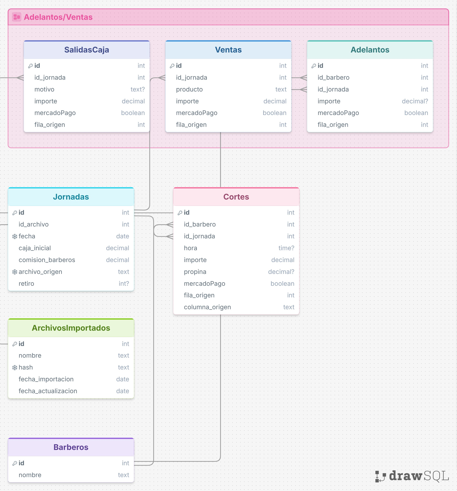

# Database

The local environment currently uses `barberia_prod`. A separate test database can be added later if needed.

Historical data is imported from Excel files under `Fechas/`.

## Local Setup

Start PostgreSQL:

```sh
docker compose up -d postgres
```

Default environment:

```sh
POSTGRES_USER=barberia
POSTGRES_PASSWORD=barberia_local
POSTGRES_HOST=localhost
POSTGRES_PORT=5433
POSTGRES_DB=barberia_prod
IMPORT_YEAR=2026
```

`database/init.sql` creates `barberia_prod` and loads `database/schema.sql`.

## Files

- `docker-compose.yml`: PostgreSQL container.
- `database/init.sql`: database creation and schema load.
- `database/schema.sql`: tables, primary keys, unique constraints, and foreign keys.
- `scripts/import_fechas.py`: Excel importer.

## Tables



- `ArchivosImportados`: imported file name, hash, import date, update date.
- `Jornadas`: one work day from one Excel file.
- `Barberos`: barber names.
- `Cortes`: haircut rows per barber and jornada.
- `SalidasCaja`: cash withdrawal rows.
- `Ventas`: product sales.
- `Adelantos`: barber advances.

`Jornadas` is the parent table for daily imported data. `Cortes`, `SalidasCaja`, `Ventas`, and `Adelantos` reference it through `id_jornada`.

## Jornadas

`Jornadas` stores:

- `fecha`: business date.
- `caja_inicial`: opening cash amount.
- `comision_barberos`: barber commission percentage/value from the sheet.
- `retiro`: withdrawal amount from the `Retiro:` field, or `NULL`.
- `archivo_origen`: source Excel path.

`fecha` and `archivo_origen` are unique.

## Import

Run:

```sh
python scripts/import_fechas.py
```

The importer reads:

```text
Fechas/*/*.xlsx
```

Temporary Excel lock files starting with `~$` are ignored.

For each Excel file, the importer:

- computes the file hash;
- creates or updates `ArchivosImportados`;
- creates or updates one `Jornadas` row;
- loads `Cortes`, `SalidasCaja`, `Ventas`, and `Adelantos`.

If the file was already imported with the same hash, it is skipped.

If the file hash changed, the importer deletes and reloads only the child rows for that file's jornada.

## Excel Mapping

The main sheet contains barber blocks:

- `Hora`
- `amount`
- `Propi`
- `MP`

Only rows `4..34` are treated as haircut rows.

The importer also reads:

- `Retiro:` from the main sheet into `Jornadas.retiro`;
- `Salida de caja` rows into `SalidasCaja`;
- `Ventas` rows into `Ventas`;
- `Adelantos` rows into `Adelantos`.

## Nullable Values

If a value is empty or badly formatted and the database column allows `NULL`, the importer stores `NULL`.

Examples:

- invalid or missing `Cortes.hora` -> `NULL`;
- empty `Cortes.propina` -> `NULL`;
- empty `SalidasCaja.motivo` -> `NULL`;
- invalid `Adelantos.importe` -> `NULL`;
- missing or invalid `Jornadas.retiro` -> `NULL`.

Required numeric fields such as haircut amount must be parseable, otherwise the row is not imported.

## Reset Local Database

This deletes the PostgreSQL Docker volume and all local data:

```sh
docker compose down -v
docker compose up -d postgres
```

Use it only when local data can be discarded.
